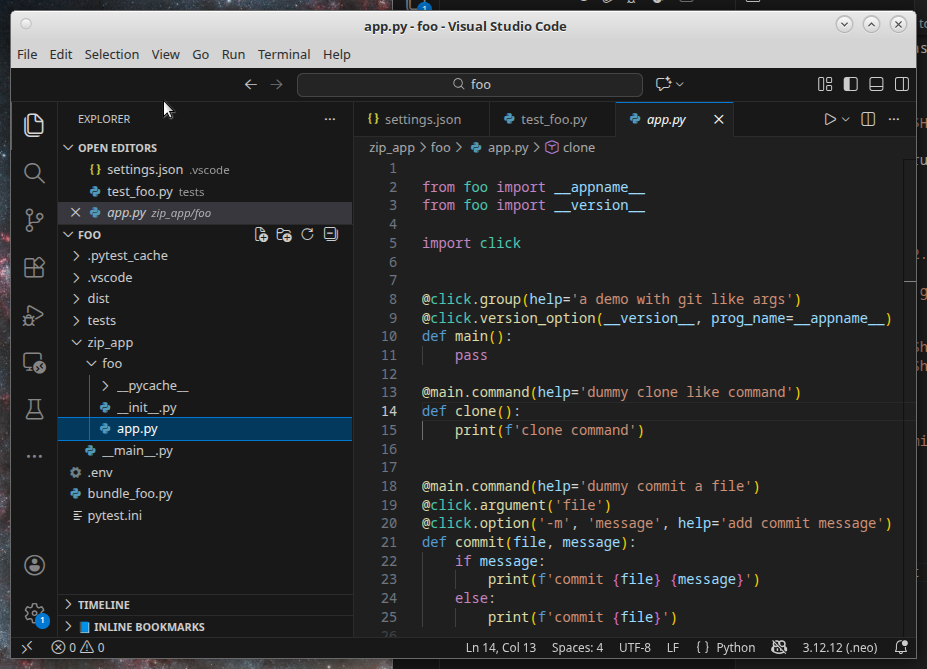
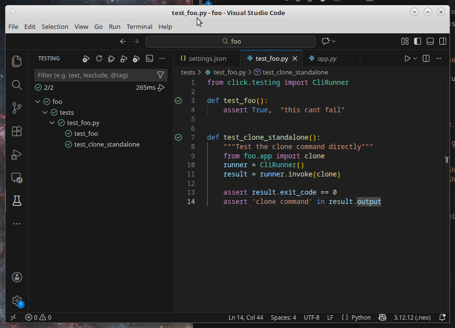

# How to setup a mulit project repo with tests

This shows a setup with 2 zipapps, their bundlers, their virtualenv bootstrappers, the pytest setups to properly import from the zipapps, and the vscode settings to properly resolve the virtualenv paths and app imports.


## The two zipapp projects (see.. [python zipapps](https://docs.python.org/3/library/zipapp.html)). 

foo and bar are 2 working projects in the repo. They are self contained projects that can be deployed by copying the pyzip file that the bundlers produce.

running bundle_foo.py produces a zip in the `dist/foo-<version>` directory and prints out the location of this zipapp object. The version number is derrived by the app's [`__init__.py`](./foo/zip_app/foo/__init__.py) file where you can see the release notes too.


```bash
$ ./foo/bundle_foo.py 
/home/user/repo/foo/dist/foo-0.2.1
$ ./bar/bundle_bar.py 
/home/user/repo/bar/dist/bar-0.1.0
```

This app is a working copy, and is ready to be deployed 

```bash
$ /home/user/repo/foo/dist/foo-0.2.1 --help
Usage: foo-0.2.1 [OPTIONS] COMMAND [ARGS]...

Options:
  --version  Show the version and exit.
  --help     Show this message and exit.

Commands:
  clone
  commit  commit a file
$ 
```

deployment is to simply copy it to the $HOME/bin/ dir without the version number, or use links to pick the current version

```bash
$ cp /home/user/repo/foo/dist/foo-0.2.1 ~/bin/
$ rm ~/bin/foo
$ ln -s  /home/user/repo/foo/dist/foo-0.2.1 ~/bin/foo
$ foo --version
foo, version 0.2.1
```

## Developing code.

During development you will need to rebuild this a lot then run it. But you can use shell command subsitution to make this transparent.

Use an alias to the bundler, so it can build the zip then pass it back to be ran.

```
$ alias foo='$($HOME/repo/foo/bundle_foo.py)'
$ foo --version
foo, version 0.2.1
```
**how this works**

The `$(command)` will run that command `bundle_foo.py` and the result of that operation will be executed. So the bundler creates the zip and prints out the location of the zip as the result. 

So this...

`$($HOME/repo/foo/bundle_foo.py) --version` 

becomes...

`/home/user/repo/foo/dist/foo-0.2.1 --version`

So if you alias is 

```bash
$ which foo
alias foo='$($HOME/repo/foo/bundle_foo.py)
```
you can just run it naturally like it was deployed, but it will be re-building each time you run it.

```bash
$ foo --help
Usage: foo-0.2.1 [OPTIONS] COMMAND [ARGS]...

  a demo with git like args

Options:
  --version  Show the version and exit.
  --help     Show this message and exit.

Commands:
  clone
  commit  commit a file

```


## Using vscode 

When you start vscode, load up one of the apps as the working dir




This will configure all paths so that you can run pytests in teh tests screen (the test tube icon) 




this comes from the [./vscode/settings.json](./foo/.vscode/settings.json) file from each project and allows you to pick the same virtual env that the app uses.


## Autobooting the apps virtual env. 

This is outside the scope of this demo at the moment. But will be added.